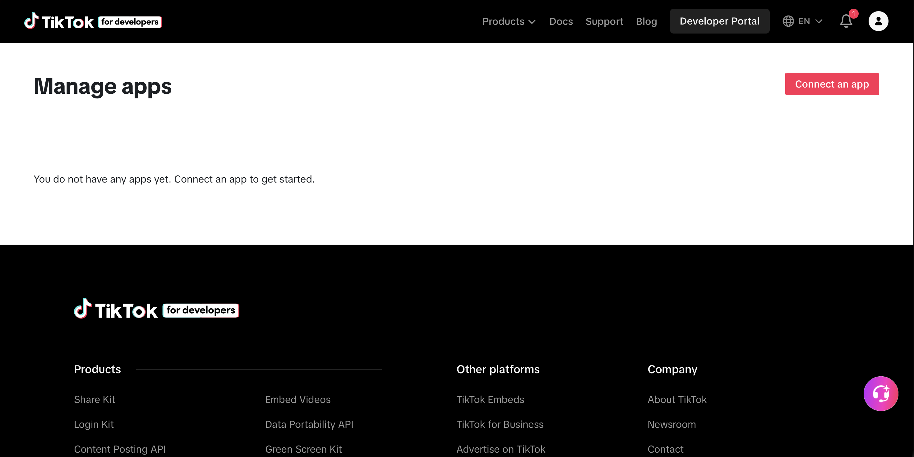
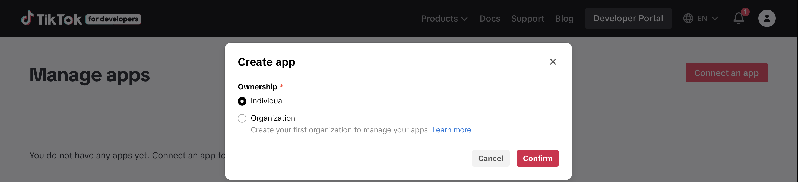
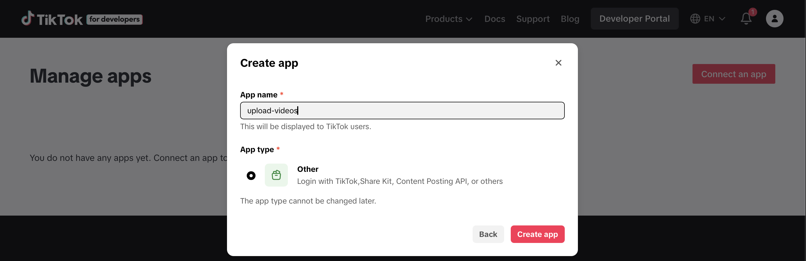
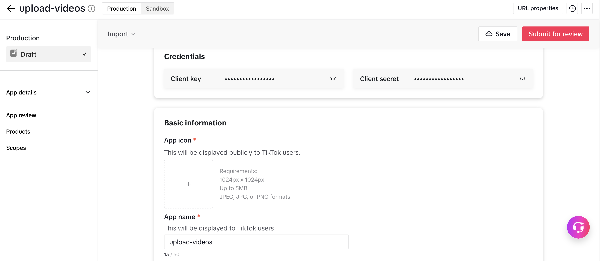
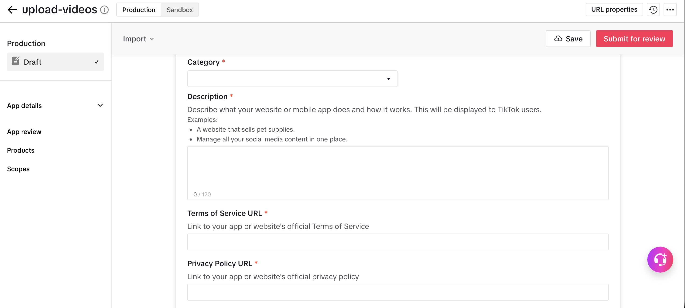
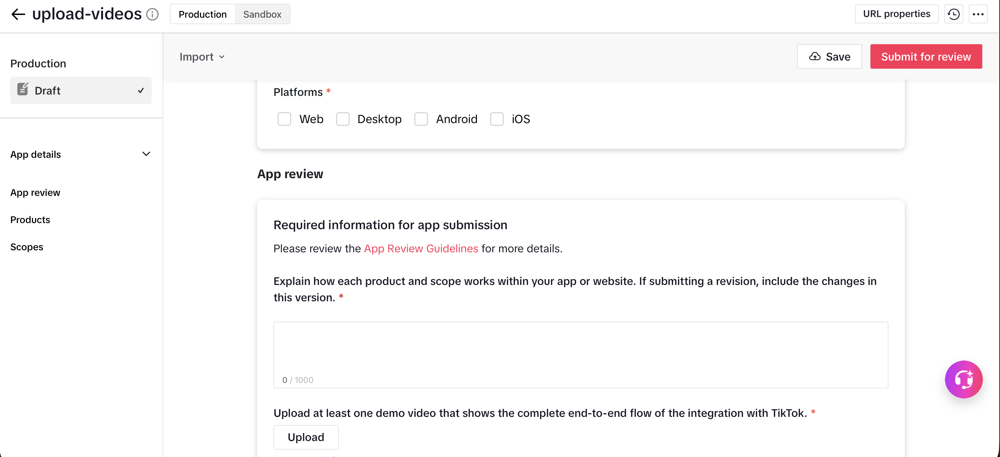
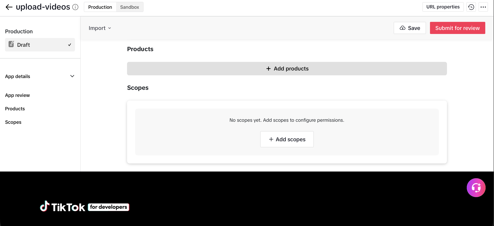
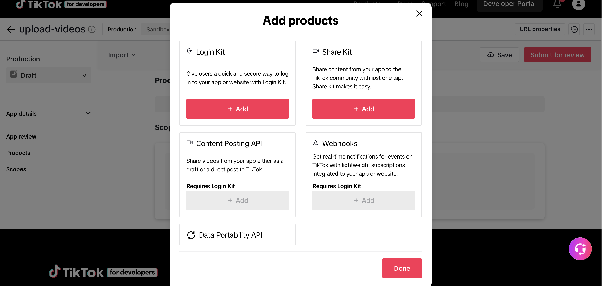

# Configurar la app de TikTok for Developers para `clipengine`

Guía paso a paso para crear y configurar la app de TikTok que necesita `clipengine publish tiktok` (Fase 3, ver `README.md`). Esto es un trámite de **una sola vez por app** — una vez hecho, solo tocás esta pantalla de nuevo si necesitás rotar credenciales, agregar scopes o pasar la auditoría.

## Antes de empezar

- Necesitás una cuenta en [developers.tiktok.com](https://developers.tiktok.com/), asociada a tu cuenta de TikTok.
- `clipengine` usa dos productos de TikTok: **Login Kit** (OAuth) y **Content Posting API** (subir el video). Content Posting API requiere Login Kit habilitado primero.
- Vas a necesitar una **URL pública con HTTPS** para Términos de Servicio y Política de Privacidad — no puede ser `localhost`. Si no tenés un dominio, una página simple en GitHub Pages o Vercel alcanza.

---

## Paso 1 — Crear la app

Entrá a **Developer Portal → Manage apps** y hacé clic en **Connect an app**.



Se abre el modal **Create app**. Elegí el tipo de ownership:

- **Individual** — para un proyecto personal como `clipengine`, esta es la opción correcta.
- **Organization** — solo si vas a gestionar la app a nombre de una empresa/equipo.



En el siguiente paso, completá:

- **App name**: el nombre que van a ver los usuarios de TikTok en la pantalla de autorización (ej. `upload-videos` o `clipengine`).
- **App type**: elegí **Other** — *"Login with TikTok, Share Kit, Content Posting API, or others"*. Es la opción correcta para un uso vía API/CLI como `clipengine`, no una app publicada en tiendas.



Confirmá con **Create app**.

---

## Paso 2 — Guardar las credenciales

Al entrar a la app recién creada, TikTok te muestra el **Client key** y el **Client secret** (ambos ocultos por defecto, con el ícono de ojo para revelarlos).



Copialos a tu `.env` de `clipengine`:

```bash
TIKTOK_CLIENT_KEY="tu_client_key"
TIKTOK_CLIENT_SECRET="tu_client_secret"
```

> El client secret solo se muestra completo mientras estás logueado en el dashboard — no hay forma de recuperarlo después si lo perdés, tenés que regenerarlo.

---

## Paso 3 — Completar la información básica

Bajando en la misma página (**App details → Basic information**), completá los campos obligatorios:

- **App icon**: 1024×1024px, hasta 5MB, JPEG/JPG/PNG.
- **App name**: ya viene precargado del paso anterior.
- **Category**: la que más se acerque (ej. *Productivity* o *Tools*).
- **Description** (máx. 120 caracteres): qué hace tu app. Ejemplo: *"Sube clips generados automáticamente a TikTok desde un pipeline local."*
- **Terms of Service URL** y **Privacy Policy URL**: tienen que apuntar a un dominio público con HTTPS que vos controles.



Más abajo, en **Platforms**, marcá **Web** (`clipengine` corre un servidor OAuth local, pero de cara a TikTok cuenta como flujo web).



---

## Paso 4 — Agregar los productos (Login Kit + Content Posting API)

En la sección **Products**, hacé clic en **+ Add products**.



Se abre el modal con las opciones disponibles:



1. Agregá **Login Kit** primero (`+ Add`) — es requisito para todo lo demás.
2. Con Login Kit agregado, **Content Posting API** se desbloquea (antes aparece en gris con *"Requires Login Kit"*). Agregalo también.
3. No necesitás **Share Kit**, **Webhooks** ni **Data Portability API** para lo que hace `clipengine`.

Al configurar Login Kit, TikTok te pide un **redirect URI**. Tiene que coincidir **exacto** con lo que espera `clipengine`:

```
http://localhost:8912/callback
```

Ese `8912` es el default de `PUBLISH_OAUTH_PORT` en `.env.example`. Si ese puerto ya está ocupado en tu máquina, cambialo en el `.env` **y** en el redirect URI de la app — tienen que quedar siempre idénticos.

---

## Paso 5 — Configurar los scopes

Dentro de la misma sección, en **Scopes**, agregá los permisos que necesita Content Posting API para publicar en tu nombre:

- `user.info.basic`
- `video.publish`
- `video.upload`

> **Heads-up**: algunos usuarios reportan que TikTok ya no muestra el scope `video.create` en la consola (era parte de guías más viejas de otras integraciones tipo Postiz). No es un scope que `clipengine` necesite — con `video.publish` + `video.upload` alcanza para el flujo de subida directa. Si te aparece un error de scope faltante, es más probable que sea un scope mal tildado que este.

---

## Paso 6 — App review (auditoría)

Mientras tu app esté en estado **Draft** (sin pasar la auditoría de TikTok), la Content Posting API **sigue funcionando**, pero con una restricción dura de la plataforma: todo lo que publiques vía API queda forzado a **`SELF_ONLY`** (visible solo para vos), sin importar lo que pida el código de `clipengine`.

Para levantar esa restricción tenés dos caminos:

- **Rápido, manual**: publicar con `clipengine publish tiktok` y después cambiar la visibilidad del video a mano desde la app de TikTok.
- **Definitivo**: completar el **App review** — bajando en la misma página vas a encontrar:
  - Un campo de texto (hasta 1000 caracteres) donde tenés que explicar cómo funciona cada producto/scope dentro de tu app.
  - Un video demo obligatorio mostrando el flujo end-to-end de la integración con TikTok.


Una vez que TikTok aprueba la auditoría, los posts salen públicos automáticamente sin el paso manual.

---

## Paso 7 — Autorizar tu cuenta desde `clipengine`

Con la app ya creada y las credenciales en el `.env`, el último paso es autorizar tu cuenta de TikTok (esto abre el navegador una sola vez; el token se guarda y se refresca solo):

```bash
pip install -e ".[publish,dev]"
clipengine auth tiktok
```

Y para publicar:

```bash
PUBLISH_TIKTOK=true clipengine publish tiktok --output-dir ./output
```

---

## Checklist rápido

- [ ] App creada como **Individual**, tipo **Other**
- [ ] `TIKTOK_CLIENT_KEY` y `TIKTOK_CLIENT_SECRET` copiados al `.env`
- [ ] Terms of Service URL y Privacy Policy URL en un dominio público con HTTPS
- [ ] Producto **Login Kit** agregado, con redirect URI `http://localhost:8912/callback` (o el puerto que definiste en `PUBLISH_OAUTH_PORT`)
- [ ] Producto **Content Posting API** agregado
- [ ] Scopes `user.info.basic`, `video.publish`, `video.upload` agregados
- [ ] `clipengine auth tiktok` corrido con éxito
- [ ] (Opcional, para posts públicos automáticos) App review completado

## Troubleshooting

**Error "please correct: client_key" al hacer login** — normalmente significa que el redirect URI configurado en la app de TikTok no coincide exactamente con el que usa `clipengine` (`http://localhost:8912/callback` o tu `PUBLISH_OAUTH_PORT` custom), o que el client key en tu `.env` no corresponde a esta app.

**Publiqué pero solo yo lo veo (`SELF_ONLY`)** — esperado si tu app no pasó la auditoría todavía. No es un bug de `clipengine`, es una restricción de TikTok mientras la app está en Draft (ver Paso 6).

**`clipengine publish` falla por token vencido/revocado** — corré `clipengine auth tiktok` de nuevo para volver a loguearte desde cero.
